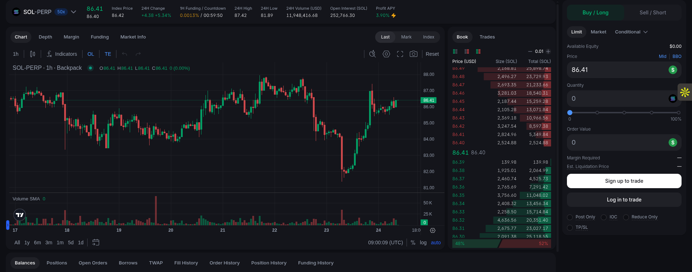
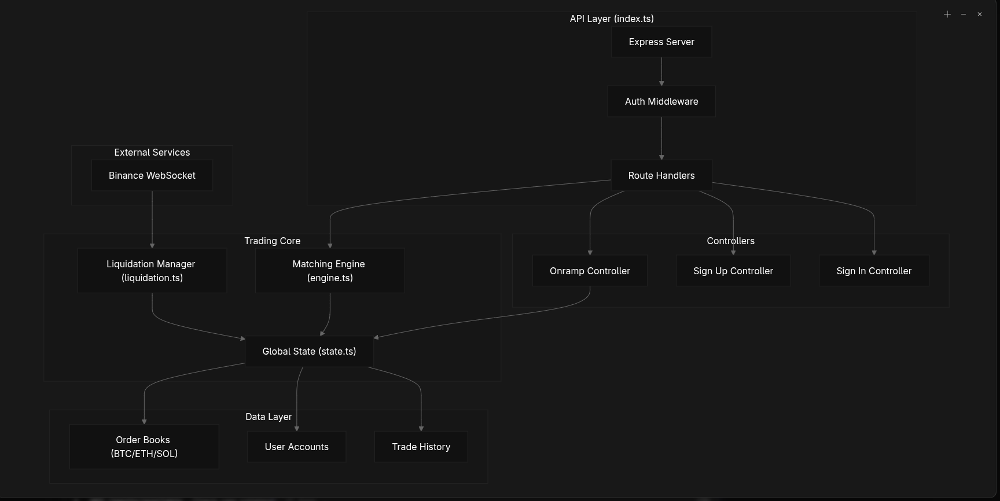
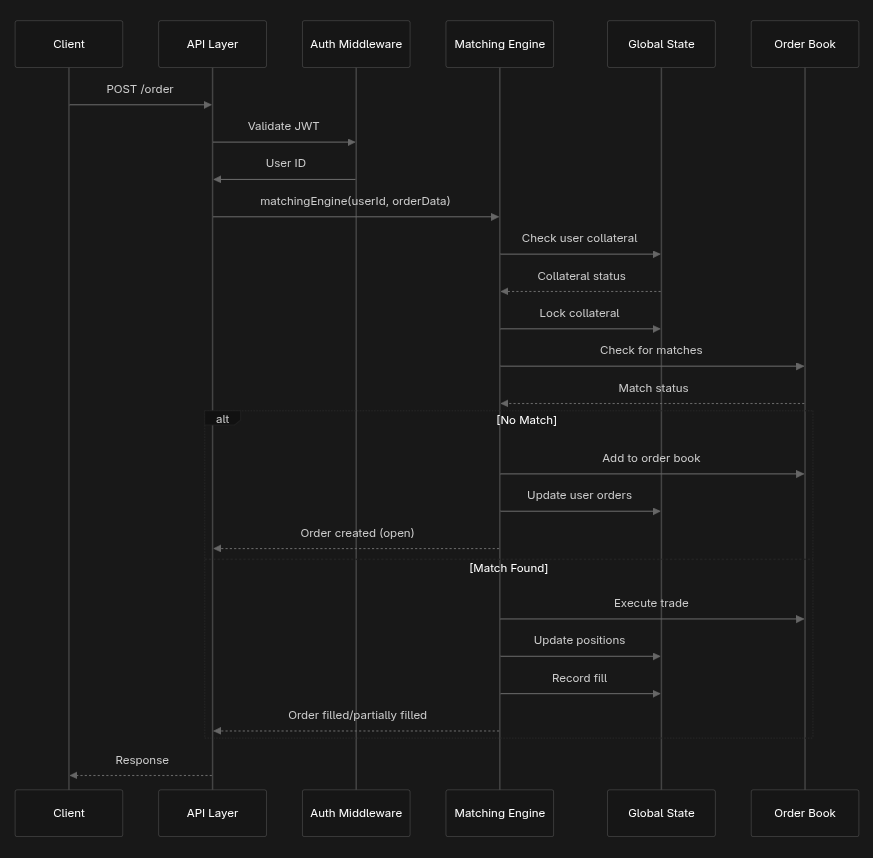

# perp

An in-memory perpetual trading platform built with Bun, TypeScript, Express, WebSockets, and Zod.



It supports:

- user sign-up and sign-in
- JWT-protected trading endpoints
- collateral on-ramping
- market and limit order placement
- order cancellation
- open and closed position tracking
- trade fill history
- automatic liquidation checks based on Binance mark price streams

## Tech stack

- Bun runtime
- Express 5
- TypeScript
- Zod for request validation
- bcrypt for password hashing
- jsonwebtoken for auth tokens
- ws for Binance price streaming
- axios for liquidation requests
- heap-js for order book price priority queues

## Setup

Install dependencies:

```bash
bun install
```

Run the server:

```bash
bun run index.ts
```

The default port is `5000`.

## Environment variables

Required:

- `JWT_SECRET`: used to sign and verify user session tokens
- `ADMIN_SECRET`: used to authorize liquidation requests

Optional:

- `PORT`: server port, defaults to `5000`
- `BASE_URL`: base URL used by the liquidation service when it posts back to the app

## Architecture

### Higher Level Architecture


### Order Flow Architecture



## Core domain model

### Markets

Supported markets:

- `SOL`
- `ETH`
- `BTC`

### Orders

Order types:

- `LONG`
- `SHORT`

Order execution types:

- `market`
- `limit`
- `liquidation`

Order statuses:

- `open`
- `filled`
- `partially_filled`
- `cancelled`
- `partially_filled_cancelled`

### Positions

Each user may have:

- open positions
- closed positions

Positions track:

- market
- side
- quantity
- margin
- liquidation price
- realized PnL
- average entry price

## Authentication

### Sign up

Creates a user with a hashed password and empty balances.

### Sign in

Returns a JWT that expires after 10 minutes.

### Protected routes

All authenticated routes require:

```http
Authorization: Bearer <jwt>
```

The JWT payload contains the user id.

## API endpoints

### Health

`GET /health`

Returns server status.

### Auth

`POST /signup`

Request body:

```json
{
	"username": "string",
	"password": "string"
}
```

Validation:

- username minimum length: 6
- password minimum length: 6

`POST /signin`

Request body is the same as sign-up.

Returns:

```json
{
	"success": true,
	"token": "jwt-token"
}
```

### Collateral

`POST /onramp`

Authenticated.

Request body:

```json
{
	"amount": 1000
}
```

Adds funds to the user’s available collateral.

`GET /equity/available`

Authenticated.

Returns available, locked, and total collateral.

### Orders

`POST /order`

Authenticated.

Request body:

```json
{
	"price": 100,
	"qty": 2,
	"equity": 20,
	"type": "LONG",
	"market": "BTC",
	"orderType": "limit"
}
```

Authenticated.

Request body:

```json
{
	"orderId": "string"
}
```

Cancels an open or partially filled order and releases the unused margin.

`GET /orders/:marketId`

Authenticated.

Returns all user orders for a market.

`GET /orders/open/:marketId`

Authenticated.

Returns open and partially filled orders for a market.

### Positions

`GET /positions/open/:marketId`

Authenticated.

Returns open positions for a market.

`GET /positions/closed/:marketId`

Authenticated.

Returns closed positions for a market.

### Fills

`GET /fills`

Authenticated.

Returns all fills where the user was the maker or taker.

### Liquidation

`POST /liquidate`

Admin-only endpoint.

This route is called internally by the liquidation watcher.

It accepts the same order payload as the trading route, plus `userId`, and routes through the same matching engine.

## Matching engine behavior

The matching engine lives in engine.ts.

### Market orders

Market orders are converted to a price using the best price currently available in the order book. If no matching book side exists, the current mark price is used.

### Limit orders

Limit orders compare against the best available opposite-side price:

- LONG orders match against asks
- SHORT orders match against bids

If no match exists, the order is added to the book.

### Partial fills

The engine supports:

- full fills across multiple price levels
- partial fills at a single price
- remaining quantity staying open in the book

### Position updates

When trades execute, positions are updated in memory:

- same-side fills increase the position and recalculate weighted average entry price
- opposite-side fills net the position and move realized PnL into collateral
- closed positions are stored separately

## Liquidation flow

The liquidation service in liquidation.ts connects to Binance mark price streams for:

- `btcusdt@markPrice`
- `ethusdt@markPrice`
- `solusdt@markPrice`

When a new mark price arrives:

1. the local mark price and index price are updated
2. every user position for that market is checked
3. positions at or beyond liquidation price trigger a liquidation order
4. the liquidation order is submitted through the `/liquidate` endpoint

## Important limitations

- state is not persisted
- the order book exists only in memory
- liquidation calls use an HTTP round trip instead of a direct function call
- market order pricing falls back to the current mark price if no book depth exists

## Notes

- The app starts the Binance websocket listener on startup.
- Authentication is done with short-lived JWTs.
- Order book prices are tracked with heaps for best-bid / best-ask lookup.
- This codebase is a trading simulation and should not be used as production trading infrastructure without major hardening
